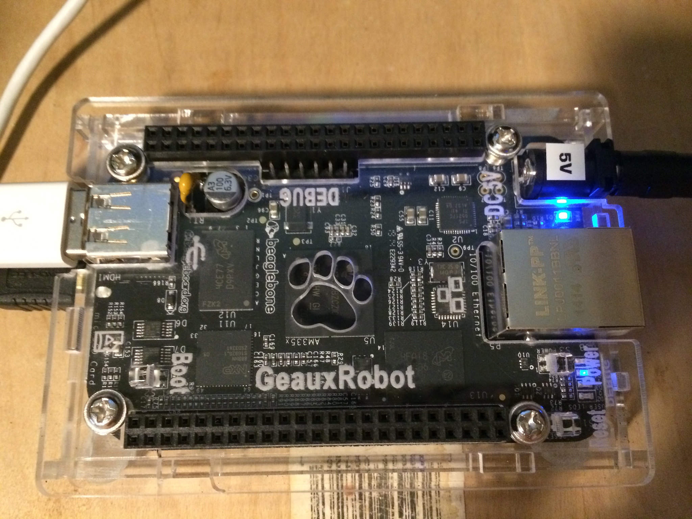
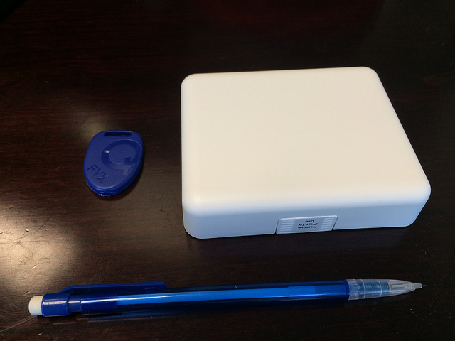
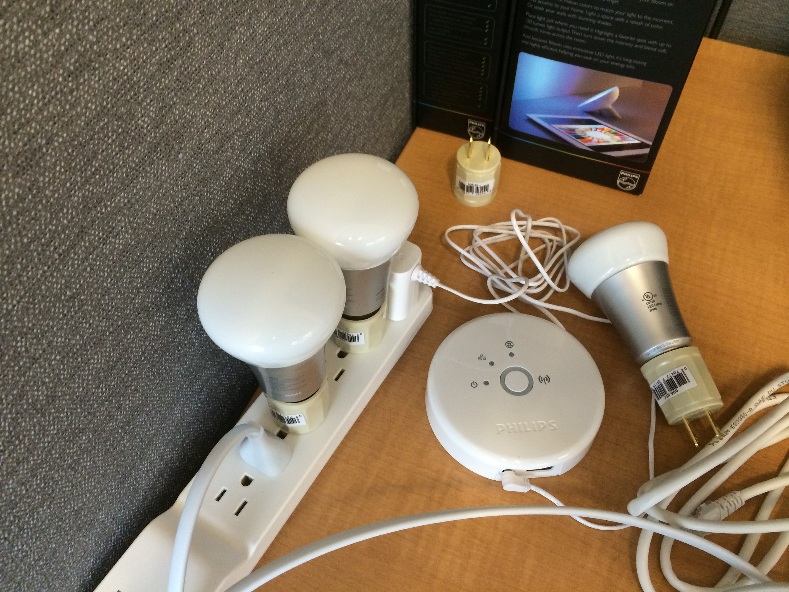

# What is a Hackathon
* An opportunity to learn.
* A party and an opportunity to socialize.
* An opportunity to win some prizes.

# Venue
  The hackathon is part of the [EMEA PUG Challenge](http://www.pugchallenge.eu/) which this year is at Dusseldorf, in the [Hilton Dusseldorf](http://www3.hilton.com/en/hotels/north-rhine-westphalia/hilton-dusseldorf-DUSHITW/index.html).

# Dates
  EMEA PUG Challenge is Wednesday, Nov 19 to Friday, Nov 21st.  Official hours for the hackathon are Wed 6pm to 9pm and then
Thu 8pm to 10pm, but the room will be available at other times.   Awards are presented on Friday after the general session.

(Judging will happen -- TBD!)

# Prizes
Prizes are a key part of Hackathons!

All **participants** will get

1. iBeacons Gimbal Series 10 to give away (maybe enough for each participant)
1. PROMO codes for Modulus for all participants. (value still TBD)
1. PROMO codes for Rollbase for all participants. (value still TBD)

**Winners** will get awarded one of (not all prizes are committed at this point; I'm awaiting to get a rough count for attendees)

1. one [BeagleBone Blacks](http://beaglebone.org/black) (BBB)
1. one entry level [Philips Hue Starter Kits](http://store.apple.com/us/product/HFV02VC/A/philips-hue-lux-starter-pack)
(1 bridge + 2 white only LEDs)
1. one LG Android Wear G-watch
1. one iPod Touch (this is a great developer iOS device).
1. one iBeacon Gimbal Series 20

The BBB are system-in-a-card computers, akin to Arduinos or Rasperry Pi but a bit more high-powered.
Think of these as having the power of a premium smartphone of a couple of years ago.
They have a micro-HDMI, Ethernet, and host and slave USB ports;
the chip is an ARM Cortex-A8 1GHz.
These cuties are fun and will run your Node.js stack, your Linux apps, your Chrome browser, or whatever! 

The Gimbal Series 10 is a small Apple iBeacon that uses a button battery.  The Series 20 is the size of an
Apple white brick and uses 4 AA batteries.

The Philips Hue SDK includes a bridge with an ethernet port, and several [ZigBee](http://zigbee.org)-compliant LED bulbs.
The bulbs are controlled by sending HTTP requests to the bridge which then converts them into ZigBee commands
using the [Light Link standard](http://www.zigbee.org/Standards/ZigBeeLightLink/Overview.aspx) which move
from bridge to bulb to bulb using a mesh topology.  A single bridge can control up to 50 bulbs.

You can read about these gizmos in a number of places, including in [this post](https://bizappstoday.progress.com/2014/10/ibeacons-philips-hue-node-twice.html) or in [these ones](http://pelegri.wordpress.com/2014/08/07/2014-summer-interns/).

# HARDWARE Lending Library

We will also bring some extra goodies for your hacks.  Current plan is

1. The iBeacons Series 10 and Series 20
1. Some Philips Hue SDK
1. A Phlips Hue light strip and a Boom Light
1. (maybe) a MS Band.
 

# Support people
**Eduardo** Pelegri-Llopart, Progress - [blog](http://pelegri.wordpress.com), [@pelegri](http://twitter.com/pelegri), [email](mailto:epelegri@progress.com)  
**Ludovic** Aelbrecht, Progress - [email](mailto:laelbrecht@progress.com)  

# Theme
Theme:  Node.js (Modulus / MongoDB) + IOT ( Qualcomm Gimbal / Philips Hue / Wearable ) + Rollbase + Mobile + ...

### Modulus
Modulus is a Node.js hosting platform that provides a complete technology stack for application developers. This includes custom SSL, WebSockets, MongoDB, statistics, and [more](https://modulus.io/features).
There are a number of [AddOns available](http://addons.modulus.io),
including [Searchly](https://addons.modulus.io/searchly), [IronWorker](https://addons.modulus.io/searchly),
[KeenIO](https://addons.modulus.io/searchly), [IronMQ](https://addons.modulus.io/searchly)
and [SendGrid](https://addons.modulus.io/searchly).
Note that all these addons have a free entry level.  There are also over 103K modules at [NPM](http://npmjs.org).

You can learn more about Modulus from the [Modulus blog](http://blog.modulus.io)
and the [Modulus Help Page](http://help.modulus.io).

Using Modulus requires loging in, which can be done with your Github id, or with a Modulus account.
Modulus [registration](https://modulus.io/register) automatically gives you $15 free Modulus credit, about one month;
attendees at EMEA PUG Challenge can use **promo** _TBD_ worth $30 Modulus credits.

**Samples** - You can find multiple useful open source samples at [github.com/onmodulus](http://github.com/onmodulus).
Node and MongoDB are widely used in the internet; an internet search will likely find you a sample of pretty much 
anything you are interested in.

### Rollbase
Rollbase is a cloud platform for the rapid creation and deployment of applications.  Rollbase applications are built
by defininig object types with fields from different sources, and views and pages to interact on objects, with support
for triggers, workflow, javascript actions, and more.  Depending on your background, you will recognize features present in
[Force.com](http://force.com), or in [Parse](http://parse.com).

Rollbase is used through a cloud tool delivered on your favorite browser.   You will need an account; registration is
[here](https://www.progress.com/trynow) and includes a free 30 day tryout.

For a description of the Rollbase features check this [overview of features](https://www.progress.com/products/rollbase/features),
the [detailed documentation site](http://documentation.progress.com/output/Rollbase/index.html). Keegan had used Parse previously
and adapted to Rollbase very quickly; check his [writeup](http://mendoncakeegan.wordpress.com/2014/08/22/angular-rollbase-blog/).

If you want really detailed info on Rollbase (and Rollbase Mobile), check the [Exchange 2014 tracks](https://community.progress.com/community_groups/user_conferences/w/exchange/2328.exchange-2014-breakout-sessions.aspx#Track1).

**Samples** - You can find multiple open source samples at [github.com/progress](http://github.com/progress).  They cover
Rollbase, Node, Mongo, ExpressJS, AngularJS, IOT (Philips Hue and iBeacons) and others.  You can also find additional information
in the blogs of [David Inglis](http://dcinglis.wordpress.com) and [Keegan Mendoca](http://mendoncakeegan.wordpress.com)

### Rollbase Mobile
Rollbase Mobile is an online tool that can be used to create hybrid mobile apps using
[Apache Cordova](http://cordova.apache.org).
The tool uses the same
registration as Rollbase (the overall brand is called Pacific).
The direct link to the tool is [here](https://mobile.rollbase.com).

Rollbase Mobile also includes several server-side services. Detailed documentation on Rollbase Mobile is [here](http://docs.mobile.rollbase.com/tutorials/).

# Samples and More

The samples at [github.com/onmodulus](http://github.com/onmodulus)
and [github.com/progress](http://github.com/progress) may provide inspiration and initial code for multiple projects including:

* Samples from the Absolute Beginners Guide - [guide](https://github.com/onmodulus/absolute-beginners-guide-nodejs)
* A Simple Demo - [demo](https://github.com/onmodulus/modulus-demo)
* A Simple Network Queue - [queue](https://github.com/onmodulus/simple-queue)
* A Real-Time Editor using PubNub and Modulus - [sample](https://github.com/onmodulus/realtime-editor)

and

* An xCode sample to monitor and range iBeacons - [Scanner](https://github.com/progress/ios-beacon-scanner)
* A Rollcall using iBeacons, iOS, Node, MongoDB and Philips Hue - [Rollcall](https://github.com/progress/roll-call)
* A Blogging sample using AngularJS, Express and Rollbase - [Blog](https://github.com/progress/angular-rollbase-blog)

The samples in github.com/progress cover a fair range of architectures.   You may want to check some presentations
mentioned [here](http://pelegri.wordpress.com/2014/10/27/latest-presentations-at-slideshare/).

### Additional Learning Links

**Node.js** - There are many learning resources.  On the Modulus side check out[An Absolute Beginnger's Guide to Node.js](http://blog.modulus.io/absolute-beginners-guide-to-nodejs), and several posts on [ExpressJS](http://blog.modulus.io/tag/express) and [Hapi](http://blog.modulus.io/tag/hapi).  Several of our samples also use [AngularJS](http://angularjs.org), which is a very popular client-side framework.

**iBeacons** - Apple has a fair amount of documentation; see [iBeacon for Developers](https://developer.apple.com/ibeacon/).  The Gimbal portal has documentation including how to activate the beacons; you will need to register and login [here](http://manager.gimbal.com).  Also see the [scanner](https://github.com/progress/ios-beacon-scanner) and the [roll-call](https://github.com/progress/roll-call) samples.

**Philips Hue** - Documentation is available [here](http://www.developers.meethue.com/). ALso see the [roll-call](https://github.com/progress/roll-call) sample.

# EMEA PUG Challenge
We welcome any hacks that use at least one of our products.  We are making the iBeacons and the Philips Hue available
to encourage you to play with these IOT elements, but you do not need to use them.

Modulus, with NOde.js and MongoDB is useful in **many** contexts.

iBeacons can be used with the Gimbal devices but other devices (like iOS, Mac and Android) also support Bluetooth Low Energy
and can also be used.

Rollbase Mobile can be used to quickly put together a Hybrid app.

ROllbase can be used to model objects and handle authentication and then to quickly generate dashboards and other applications, potentially using the Web API to drive a mobile application.

### Judging
Hacks will be judged on originality, technical difficulty, and applicability.  Hacks need to leverage at least one of the Progress offerings.

Judges will include Ludovic and Eduardo; others will be added.

